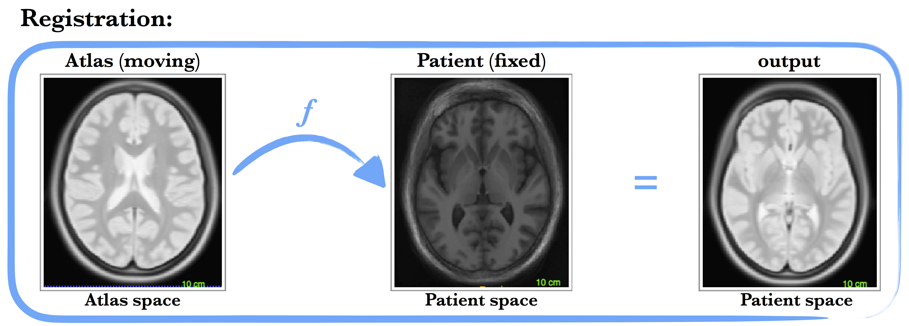

# Image Registrations Using ANTs Library
This code provides simple scripts for image registrations using ANTs library, together with examples.

References: Jana Lipkova (jana.lipkova@tum.de)
 
## 1) Install ANTs
```
git clone git://github.com/stnava/ANTs.git
mkdir antsbin
cd antsbin
ccmake ../ANTs
make -j 4
```

**Set the path to the installed library by updating your ~/.profile or ~/.basrc file with the following lines, where the first line contains path to YOUR library:**
```
export ANTSPATH=/home/jana/Work/Ants/stnava-ANTs-a430c38/antsbin/bin/
export PATH=$PATH:$ANTSPATH
```

For more installaiton info see: http://sourceforge.net/projects/advants/files/ANTS/ANTS_Latest/


## 2) Registrations scripts
Folder source contains scripts for registration:
 * scripts with word Registration in the name perfom specific registration (for now only non-deformable registrations scripts, i.e. registrations that transform the whole image). The transformation matrix is stored as output in the .mat file
 * scripts with word Transformation apply existing transformation from the mat file on the specified images


**Syntax of the scripts:**
```
./affineRegistrations.sh moving_image.nii fixed_image.nii output_image.nii
./applyTransformation.sh moving_image.nii fixed_image.nii transformationMatrix.mat output_image.nii
```

## 3) Example
Folder example contains three nifty files. 
1. We will first register atlas.nii to t1.nii with i.e. affine registration do:
```
./affineRegistration.sh atlas.nii t1.nii atlas2t1.nii
```


2. It will create also mat file with corresponding transformation. The transformation mask can be used to map the atlas brain mask atlas_mask.nii into the t1.nii:
```
./applyTransformation.sh atlas_mask.nii t1.nii atlas2t1.nii0GenericAffine.mat mask2t1.nii
```
 :panda_face:
